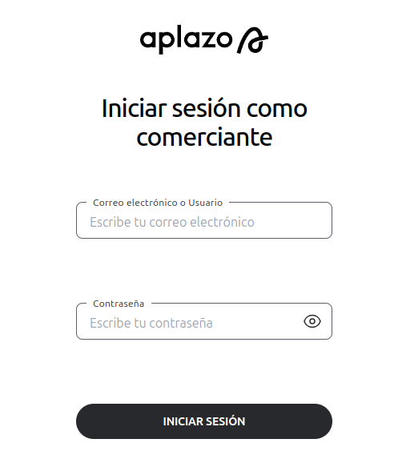

# B2bTakeHomeApp

Este proyecto esta pensado para aplicar la prueba técnica del equipo de B2B de Aplazo.

## Contexto

Estamos en un proceso de migracion de nuestro proyecto legacy, el cual necesita desacoplar la UI de `Angular Material` por lo que estamos construyendo nuestra propia libreria de componentes.
Además de lo anterior, queremos que la mayor parte de la lógica de negocio se encuentre completamente desacoplada de la UI, esto nos ayudara a agilizar las pruebas unitarias y a tener un código mas limpio y mantenible.

## Descripción general

Dentro del proyecto se encontrara una carpeta `projects` en la cual se encuentra la libreria de componentes que estamos construyendo, dicha libreria es `shared-ui` y al final del proceso de migración, esta libreria sera utilizada por todos los proyectos de nuestro equipo. Así mismo la librearia de componentes hace uso de `secondary entry points` para poder consumir solo los componentes que realmente se necesitan y así optimizar el tree shaking y por supuesto el bundle final de cada aplicación.

Por otro lado la aplicación la encontrara en la carpeta `src` y la organización de los archivos es la siguiente:
**`features`**: En esta carpeta se encuentran los modulos de la aplicación, cada modulo tiene su propia carpeta y dentro de esta se encuentran los componentes, servicios, pipes, etc.
**`core`**: En esta carpeta se encuentran los servicios que son compartidos por toda la aplicación, como por ejemplo los interceptores, los guards, los servicios de autenticación, etc.

La arquitectura de la aplicación se espera que este fuertemente enfocada en clean architecture con una mezcla de hexagonal. Por ejemplo:
**`features/login`**

- La capa de dominio contiene entidades, clases abstractas de repositorios, factories y demas clases que no dependen de la UI.
- La capa de aplicación contiene los casos de uso, los cuales seran el punto de contacto con nuestra UI. Es decir, el componente inyectara el caso de uso y se ejecutara el método correspondiente.
- La capa de infraestructura contiene las implementaciones de los repositorios, los servicios, los providers, etc.

## Para empezar

Para poder ejecutar el proyecto, es necesario tener instalado `Node.js` version 18+ y `npm` version 10+ en su computadora.

```bash
# Instalar las dependencias
npm install
```

```bash
# Construir la libreria de componentes
npm run build:ui
```

```bash
# Iniciar la aplicación en modo de desarrollo
npm run dev:app
```

```bash
# Construir la aplicación para producción
npm run build:app
```

## Tareas

### [Login](src/app/features/login/infra/components/login/login.component.ts)

El feature de login esta incompleto, se espera lo siguiente:

- [ ] Completar el layout como en la imagen mostrada 
- [ ] Agregar el boton del input de password para mostrar y ocultar la contraseña
- [ ] Actualmente tenemos un servicio de autenticación mockeado, sin embargo, no se esta validando el usuario y la contraseña. Implementar la validación del usuario y la contraseña en la capa de aplicación.
- [ ] Mostrar mensajes de error en caso de que el campo correo electronico o contraseña esten vacios o no sean validos. (Considera mostrar un mensaje debajo de cada campo, así como mostrar mensajes de error que sean regresados por el backend, para esto último se puede utilizar alguna libreria de toastr si se considera necesario).
- [ ] Hacer uso de RegExp para validar el correo electronico.
- [ ] Completar la implementación de la directiva [`noWhiteSpacesDirective`](projects/shared-ui/src/lib/directives/no-white-space.directive.ts) para que el input de correo electronico no permita escribir espacios en blanco y usarla en el input correspondiente.
- [ ] Completar la implementación de la directiva [`lowerCaseDirective`](projects/shared-ui/src/lib/directives/lower-case-text.directive.ts) para que el input de correo electrónico solo permita letras minusculas y usarla en el input correspondiente.
- [ ] Agregar pruebas unitarias a los componentes, directivas, casos de uso y demás clases que consideres necesario.

### [App layout](src/app/features/layout/layout.component.ts)

- [ ] Generar un titulo dinámico dependiendo de la ruta donde el usuario se encuentre 
- [ ] Agregar funcionalidad para cerrar sesión
- [ ] Al hacer click en el logo debemos redirigir al usuario a la ruta `/apz/home`
- [ ] Agregar un guard para proteger la ruta `/apz/home` y `/apz/dashboard` de usuarios no autenticados
- [ ] Agregar un guard para proteger la ruta `/auth` de usuarios autenticados
- [ ] Agregar pruebas unitarias a los componentes, servicios, guards y demás clases que consideres necesario.

#### Nice to have

- [ ] Icono dinámico en el [`sidenavLink`](projects/shared-ui/sidenav/src/sidenav-link/aplazo-sidenav-link.component.ts) (es decir, que el icono sea diferente para cada link, y que dicho icono se pueda inyectar desde el componente padre)

### [Home](src/app/features/home/infra/home.component.ts)

- [ ] Queremos implementar en la vista inicial un resumen con la información contenida en nuestra [base de datos de operaciones](src/app/features/shared/infra/db.json) tal como se muestra en la figura .
- [ ] Agregar un componente de selección múltiple para filtrar las operaciones por `branchId`
- [ ] Agregar un componente de fecha para filtrar las operaciones por `date`

### [Historial]()

- [ ] Implementar un modulo de historial de operaciones, donde se muestre la información de las operaciones realizadas por el usuario, tal como se muestra en la figura.  El número de pedido es el denominado `loanId` y la fecha de la operación es la marcada como `updatedAt`.
- [ ] Implementar un contador de operaciones y un filtro de fecha. 

#### Nice to have

- [ ] Implementar funcionalidad de sort en los headers de la tabla.

### Extras

- [ ] Dockerizar la aplicación. Incluir un archivo `Dockerfile` para montar la SPA en un servidor `nginx`.
- [ ] Implementar los servicios backend en el lenguaje de su preferencia y compartir el link al repositorio.

## Notas

> El desarrollo de la prueba debe ser realizado en una branch con el nombre `feature/[primer nombre del candidato]_[primer apellido del candidato]` (si existen conflictos agregar el segundo apellido), por ejemplo: `feature/juan_perez` y hacer un `pull request` a la rama `master` del repositorio.
